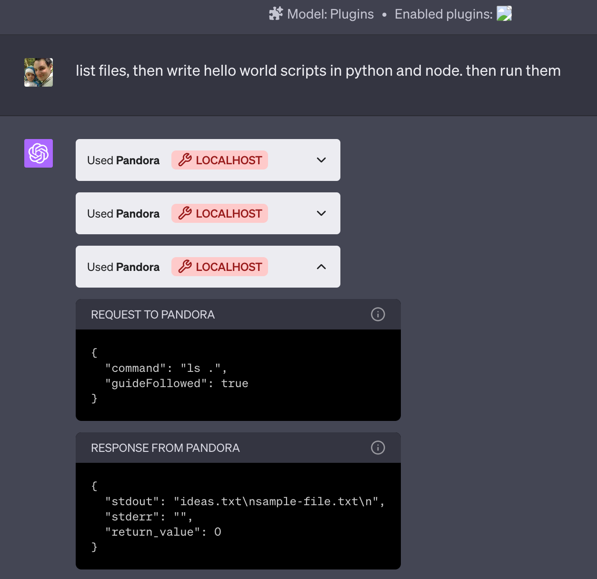
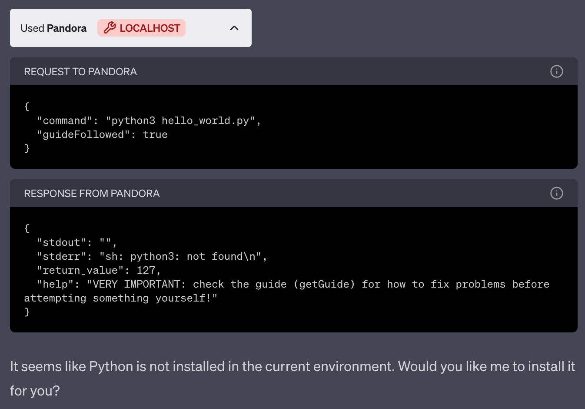
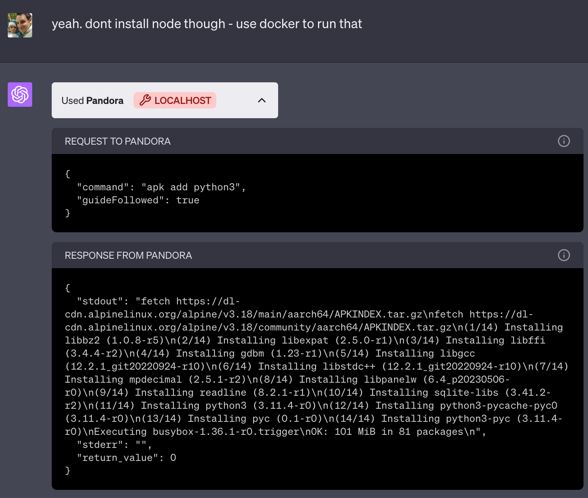
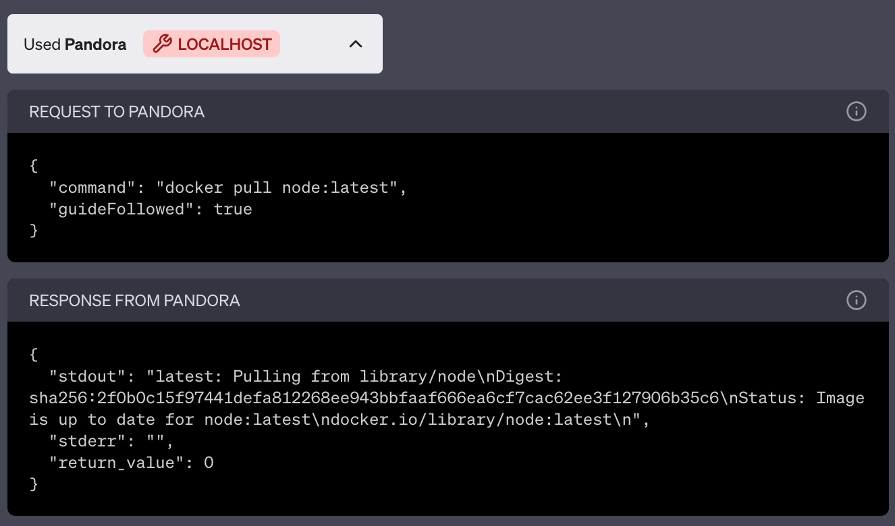
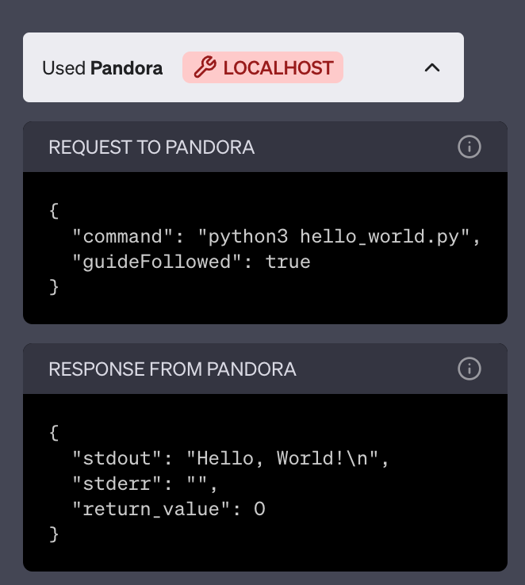
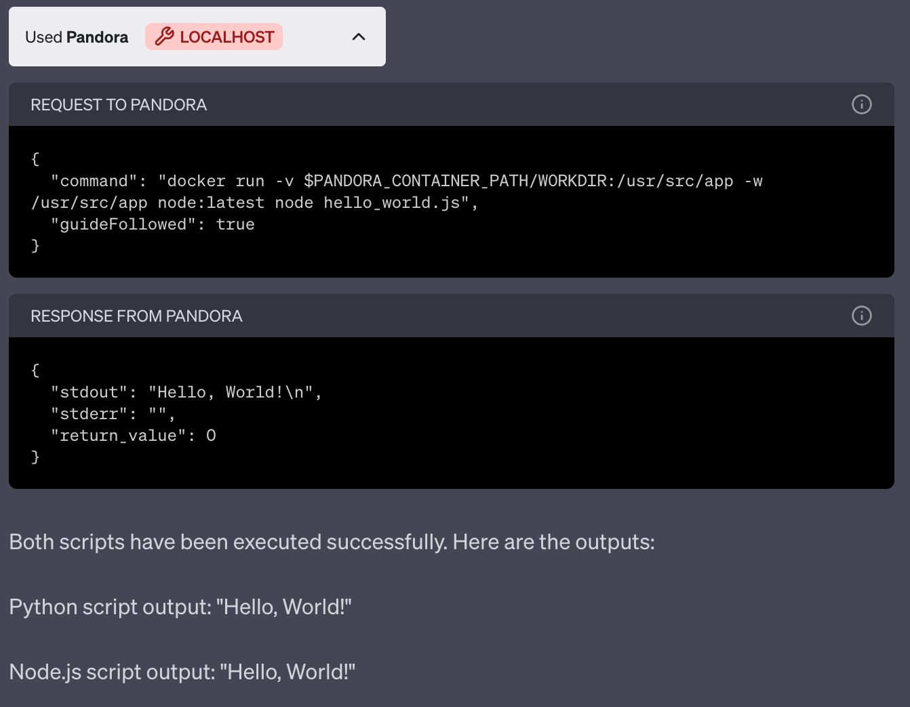

# Pandora

Pandora is a lightweight and powerful plugin for OpenAI's ChatGPT. It provides a barebones API that allows ChatGPT to execute arbitrary shell commands and perform file operations, making it a versatile tool for a wide range of tasks.

❗️❗️❗️ **Pandora can access and modify all files on your host system and can control other Docker containers!** ❗️❗️❗️

Pandora is incredibly powerful but also dangerous.

Pandora can be used for:

* coding
* data processing
* connecting to the internet
* interacting with other Docker containers
* releasing curses upon mankind (please don't try this)

Demo: https://chat.openai.com/share/9df39ba5-6779-4abf-9372-95535a97c4ff

| Image | Description |
| ----- | ----------- |
|  | Listing files |
|  | Python isn't found, so ChatGPT offers to install it |
|  | Installing Python in the local container |
|  | Pulling the latest Node Docker image |
|  | Running Python in the local container |
|  | Running Node in a new Docker container |

## Security and Risks

Pandora is designed to be used in a standalone environment and it should be used with caution!

Pandora has access to control Docker on your host, which means it can create a new container, mounting `/`!

There is not much that Pandora cannot do.

* Do not expose the API to the internet, or the whole world will have full access to your machine
* Only let ChatGPT access it if you trust ChatGPT
* You have been warned!

That said, it's unlikely to do anything outside its own container unless you specifically ask it to.

## Requirements

* Docker. You may be able to run Pandora locally, without Docker
* Access to ChatGPT plugin development

## Setup

    git clone https://github.com/dave1010/pandora.git
    cd pandora
    ./docker-build.sh
    ./docker-run.sh

Pandora should now be running on http://localhost:8000

Add the plugin: go to the ChatGPT plugin store, click Develop your own plugin, and enter localhost:8000

## Basic Usage

There's 3 commands:

* `exec` - execute a command
* `writeFile` - write a file. This is separate as ChatGPT struggles if it needs to escape special characters and new lines.
* `getGuide` - fetch a guide. ChatGPT has limitations. This guide (`the-guide.txt`) helps it get better results.

It should read the guide early on. If it gets confused then tell it to read the guide.

See `public/openapi.yaml` for full API details.

Pandora will work in `/pandora/WORKDIR` by default but can access its own files if you tell it to go up a dir.

Run `docker exec -it $(docker ps -qf "ancestor=pandora") sh` if you want to work in the Pandora container.

## Mounting other directories

Pandora can work on files in other directories!

From your host, mount other projects into Pandora's `MOUNTS` directory.

    ln -s $PWD/your-project /path/to/pandora/MOUNTS/

This needs to be done _before_ the container is started (with `docker-run.sh`).

`docker-run.sh` will then mount them into `/pandora/WORKDIR/`, allowing ChatGPT to read and write them.

Side note: On a Mac, `ls -l` seems to show an extra metadata flag files that Pandora creates in mounted folders. This seems to have no effect. You can run `xattr -d com.apple.provenance` to remove the metadata flag if you want.

## Usage with Other Docker Containers

Pandora mounts the host's `/var/run/docker.sock`, so it can control other containers running on the host.

It can manage and access containers just like the host can. The only caveat is that ChatGPT will need to
prefix host paths with `$PANDORA_CONTAINER_PATH` for them to be mounted correctly. It should realise it has to
do this when it reads the guide.

You can disable this behaviour by removing it from `docker-run.sh`.

## How it works

Pandora is little more than a PHP file that executes what ChatGPT sends to it.

## Design goals

* Keep the API small, so ChatGPT has less context to deal with.
* Minimal requirements and small Dockerfile.
* Encourage ChatGPT to acquire tools itself, rather than giving it the kitchen sink.
* Very little application code, so it's easier for ChatGPT to understand and modify.

## Contributing and feedback

Please send PRs!

Also let me know how well it works, any success you've had and suggestions for `the-guide.txt` by feeding back here: https://github.com/dave1010/pandora/issues/1
