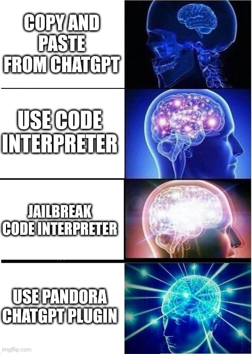

# Pandora
## ChatGPT Coding Unleashed

**Pandora gives ChatGPT the ability to read and write files and run commands on your machine.**

Pandora is a lightweight and powerful plugin for OpenAI's ChatGPT. It provides a barebones API that allows ChatGPT to execute arbitrary shell commands and perform file operations, making it a versatile tool for a wide range of tasks.

Pandora is incredibly powerful but also dangerous.

Pandora is like an unrestricted version of the ChatGPT Code Interpreter.

Read the [Introduction to the Pandora ChatGPT plugin](https://medium.com/@dave1010/making-pandora-a-super-charged-coding-plugin-for-chatgpt-670bbb60469d)
blog post.

🚨❗️⚠️ **Pandora can access and modify all files on your host system!** 🚨❗️⚠️

🚨❗️⚠️ **Pandora can control other Docker containers!** 🚨❗️⚠️

Pandora can be used for:

* coding
* data processing
* connecting to the internet
* interacting with other Docker containers
* releasing curses upon mankind (please don't try this)

The idea for Pandora came from playing with [Kaguya](https://github.com/ykdojo/kaguya), a Node project with similar functionality. Pandora is more lightweight and is focused on letting the AI find and use tools itself, including letting it install software and run Docker containers.

[Pandoras box icons created by Freepik - Flaticon](https://www.flaticon.com/free-icons/pandoras-box).

## Demos

**[Github discussion thread with demos and examples](https://github.com/dave1010/pandora/discussions/6)**. More contributions are very welcome.

* [Installing Python and running a new Docker container](https://chat.openai.com/share/9df39ba5-6779-4abf-9372-95535a97c4ff) (💬 ChatGPT transcript)
* [Installing ffmpeg to resize a video](https://chat.openai.com/share/ab22f639-6901-4c63-97a3-edf488dbdd09) (💬 ChatGPT transcript)
* [Running JS in a new Node Docker container](https://twitter.com/dave1010/status/1675556922747920384) (🎬 Video)

| Image | Description |
| ----- | ----------- |
|  | Prompt: `write hello world scripts in python and node. then run them`. Pandora writes hello world scripts in Python and Node. It fails to run them, suggesting installing Python. Prompt: `yeah. dont install node though - use docker to run that`. It then installs Python locally and runs Node in a Docker container. |

## Security and Risks

Pandora is designed to be used in a standalone host environment and it should be used with caution!

Pandora has access to control Docker on your host, which means it can create a new container, mounting `/`!

There is not much that Pandora cannot do.

* Do not expose the API to the internet, or the whole world will have full access to your machine
* Only let ChatGPT access it if you trust ChatGPT
* You have been warned!

That said, it's unlikely to do anything outside its own container unless you specifically ask it to.

## Running Pandora

### Requirements

* Docker. You may be able to run Pandora locally, without Docker
* Access to ChatGPT plugin development (currently behind a [wait list](https://openai.com/blog/chatgpt-plugins))

### Setup

    git clone https://github.com/dave1010/pandora.git
    cd pandora
    ./docker-build.sh
    ./docker-run.sh

Pandora should now be running on http://localhost:8000

Add the plugin: go to the ChatGPT plugin store, click Develop your own plugin, and enter localhost:8000

## Basic Usage

There's 3 commands:

* `exec` - execute a command in the Pandora Docker container
* `writeFile` - write a file. This is separate as ChatGPT struggles if it needs to escape special characters and new lines.
* `getGuide` - fetch a guide. ChatGPT has limitations. This guide ([`the-guide.txt`](the-guide.txt)) helps it get better results.

ChatGPT should automatically read the guide early on. If it gets confused then tell it to read the guide.

See [`public/openapi.yaml`](public/openapi.yaml) for full API details.

Pandora will work in `/pandora/WORKDIR` by default but can access its own files if you tell it to go up a dir.

Run `docker exec -it $(docker ps -qf "ancestor=pandora") sh` if you want to work in the Pandora container.

### Mounting other directories

Pandora can work on files in other directories!

From your host, mount other projects into Pandora's `MOUNTS` directory.

    ln -s $PWD/your-project /path/to/pandora/MOUNTS/

This needs to be done _before_ the container is started (with [`docker-run.sh`](docker-run.sh)).

`docker-run.sh` will then mount them into `/pandora/WORKDIR/`, allowing ChatGPT to read and write them.

Side note: On a Mac, `ls -l` seems to show an extra metadata flag files that Pandora creates in mounted folders. This seems to have no effect. You can run `xattr -d com.apple.provenance` to remove the metadata flag if you want.

### Usage with Other Docker Containers

Pandora mounts the host's `/var/run/docker.sock`, so it can control other containers running on the host.

It can manage and access containers just like the host can. The only caveat is that ChatGPT will need to
prefix host paths with `$PANDORA_CONTAINER_PATH` for them to be mounted correctly. It should realise it has to
do this when it reads the guide.

You can disable this behaviour by removing it from [`docker-run.sh`](docker-run.sh).

### Interacting with your host machine

As well as modifying its own container and managing Docker, you can even get Pandora to interact
with your host machine.

These require manually running a Python on your machine, so don't run by default.

🚨❗️⚠️ **Make sure you understand what these are doing before you run them!** 🚨❗️⚠️

#### Running commands

If you really want to open Pandora's box then you can ask it to run commands on your Docker host.
This requires running a small Python webserver [`host/host_command.py`](host/host_command.py) on port 8080.

    python3 host/host_command.py

When ChatGPT tries to run a command, it will ask you for confirmation before running the command.
Currently only supports macOS.
If you tell ChatGPT to run a command on your host machine, it should find the relevant guide 
[`guides/running-commands-on-docker-host.txt`](guides/running-commands-on-docker-host.txt)
and walk you through the steps.

This is useful for things like running `say` after a long running command or potentially
interacting with your desktop.

#### Getting secrets

You can let ChatGPT use secrets without having to send them to OpenAI!
This requires a separate small Python webserver: [`host/get-secret.py`](host/get-secret.py) on port 8080.

    python host/get-secret.py

ChatGPT will ask you for a secret, which will pop up a prompt and send it back to the Pandora container.
ChatGPT can use this as an env var or pipe it into other commands, so the secret never leaves your machine.

If you tell ChatGPT to get a secret from you, it should read the 
[`guides/get-secret-keys-or-passwords-from-user-securely.txt`](guides/get-secret-keys-or-passwords-from-user-securely.txt) guide.

## How it works

Pandora is little more than a PHP file that executes what ChatGPT sends to it.

## Design goals

* Keep the API small, so ChatGPT has less context to deal with.
* Minimal requirements and small Dockerfile.
* Encourage ChatGPT to acquire tools itself, rather than giving it the kitchen sink.
* Very little application code, so it's easier for ChatGPT to understand and modify.

## Pros and Cons vs OpenAI Code Interpreter

* Pandora can access the internet
* Pandora can use any software
* Pandora doesn't time out and remove your files
* Pandora works on your local files, so you can edit them at the same time
* Pandora can run with other plugins too
* CI seems a bit faster
* CI works on your phone
* CI keeps an interactive Python notebook process running, rather than spawning new processes for each API call
* CI is better at displaying images (Pandora can do this but it can get confused)
* CI lets you download files from the chat UI

See my [ChatGPT Code Interpreter guide](https://github.com/dave1010/exploring-chatgpt-code-interpreter) for more info.

## Contributing and feedback

Please send PRs!

If you get ChatGPT to change the API endpoints then you may get `UnrecognizedKwargsError` until you refresh the plugin in the ChatGPT Plugin devtools sidebar.  

Use Github Discussions for general feedback: https://github.com/dave1010/pandora/discussions

Please let me know how well it works, any success you've had and suggestions for [`the-guide.txt`](the-guide.txt).

## Licence

MIT License

Copyright (c) 2023 Dave Hulbert
